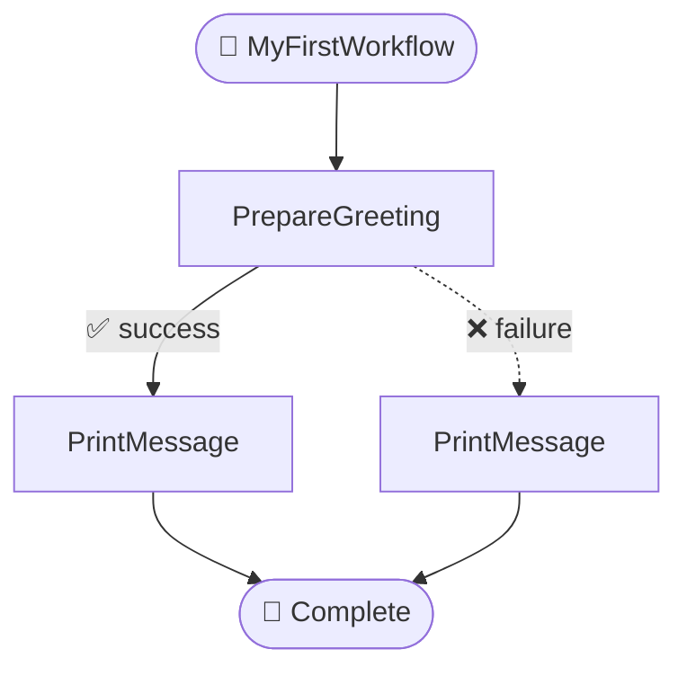

# Workflow Engine Framework

This document provides a guide to the lightweight, YAML-driven workflow engine. This framework is designed to orchestrate a series of modular, reusable tasks to create complex, automated processes. It is ideal for building applications that require a clear separation of concerns, robust error handling, and visual traceability.

This application is an example of a project built upon this framework.

## Core Concepts

The framework is built around a few key concepts:

*   **Workflow Definition (YAML/JSON)**: You define the flow of your process in a simple YAML or JSON file. This includes the sequence of tasks, how data flows between them, and error handling logic.
*   **Task Module**: The core unit of work. Each task is a Python class that inherits from `BaseTaskModule` and implements a single, focused piece of logic (e.g., calling an API, querying a database, transforming data).
*   **Task Runner**: The engine that interprets the workflow definition file, executes the tasks in the specified order, and manages the state of the workflow.
*   **Service Registry**: A central registry that automatically discovers and keeps track of all available task modules, making them available to the Task Runner.
*   **Context**: A simple dictionary that acts as the shared memory for a workflow run. Outputs from one task are placed into the context, and subsequent tasks can read from it, enabling a seamless flow of data.

## How to Use

### Step 1: Define Your Custom Tasks

First, create your task modules. Each task is a Python class that inherits from `BaseTaskModule` and implements the `execute` method. The `@task_module` decorator is used to define metadata.

**`my_tasks.py`**
```python
from src.services.framework.base_task import BaseTaskModule, task_module
from typing import Dict, Any

@task_module(
    name="PrepareGreeting",
    description="Prepares a greeting message.",
    inputs={"user_name": "The name of the user"},
    outputs={"greeting_message": "The prepared greeting message"}
)
class PrepareGreetingTask(BaseTaskModule):
    def execute(self, inputs: Dict[str, Any]) -> Dict[str, Any]:
        user_name = inputs.get('user_name', 'World')
        message = f"Hello, {user_name}!"
        print(f"Executing PrepareGreetingTask: Generated message '{message}'")
        return {"greeting_message": message}

@task_module(
    name="PrintMessage",
    description="Prints a message to the console.",
    inputs={"message_to_print": "The message to display"},
    outputs={}
)
class PrintMessageTask(BaseTaskModule):
    def execute(self, inputs: Dict[str, Any]) -> Dict[str, Any]:
        message = inputs.get('message_to_print', 'No message provided.')
        print("Executing PrintMessageTask:")
        print(f">>> {message}")
        return {}
```

### Step 2: Create a Workflow Definition File

Next, define the sequence of your tasks in a YAML file. This file specifies the steps, the module to use for each step, and how data flows between them using the `${...}` syntax.

**`my_workflow.yaml`**
```yaml
workflow_name: MyFirstWorkflow
description: A simple example to demonstrate the workflow engine.

steps:
  - id: create_greeting
    module: PrepareGreeting
    description: "Generate a greeting."
    inputs:
      user_name: ${initial_input.name}
    outputs:
      greeting_message: full_greeting
    on_success: show_message
    on_failure: handle_error

  - id: show_message
    module: PrintMessage
    description: "Display the final message."
    inputs:
      message_to_print: ${full_greeting}
    outputs: {}
    on_success: end

  - id: handle_error
    module: PrintMessage # Can reuse tasks!
    description: "Prints an error message."
    inputs:
      message_to_print: ${last_error_message}
    outputs: {}
    on_success: end
```

### Step 3: Run the Workflow

Finally, create a Python script to load the workflow, register your tasks, and run it.

**`run_my_workflow.py`**
```python
from src.services.framework.task_runner import TaskRunner
from src.services.framework.service_registry import service_registry
from my_tasks import PrepareGreetingTask, PrintMessageTask

def main():
    print("🚀 Starting workflow...")

    # 1. Register your task modules
    service_registry.register_module(PrepareGreetingTask)
    service_registry.register_module(PrintMessageTask)

    # 2. Initialize the TaskRunner with the workflow file
    runner = TaskRunner(workflow_path='my_workflow.yaml')

    # 3. Define initial inputs for the workflow
    initial_data = {
        'name': 'Jules'
    }

    # 4. Run the workflow
    final_context = runner.run(initial_inputs=initial_data)

    print("\n🎉 Workflow finished!")
    # print("Final context:", final_context)

if __name__ == '__main__':
    main()
```

## Advanced Features

### Error Handling

You can define robust workflows by specifying different paths for success and failure. Use the `on_failure` key in a step definition to direct the workflow to an error-handling step. The `TaskRunner` will automatically populate the `last_error_message` variable in the context.

```yaml
steps:
  - id: process_data
    module: RiskyDataProcessor
    on_success: format_output
    on_failure: handle_error # Go here if the task fails

  - id: handle_error
    module: ErrorLogger
    inputs:
      error_details: ${last_error_message}
    on_success: end
```

### Retries

For tasks that might fail intermittently (e.g., network requests), you can configure automatic retries.

```yaml
steps:
  - id: fetch_from_api
    module: ApiClient
    retries: 3 # Number of times to retry on failure
    retry_delay_seconds: 5 # Time to wait between retries
    on_success: next_step
    on_failure: final_error_handler
```

### Workflow Visualization

The framework includes a `WorkflowVisualizer` that generates [Mermaid.js](https://mermaid-js.github.io/mermaid/#/) diagrams of your workflow. This is incredibly useful for debugging and documentation.

The `TaskRunner` can automatically print a diagram before and after execution. To enable this, set `enable_visualization=True` when creating the `TaskRunner` instance.

```python
# In your runner script
runner = TaskRunner(
    workflow_path='my_workflow.yaml',
    enable_visualization=True # Set to True
)
runner.run()
```

This will output a Mermaid diagram to the console, which you can copy and paste into a Markdown file or the Mermaid Live Editor.

**Example Output:**
